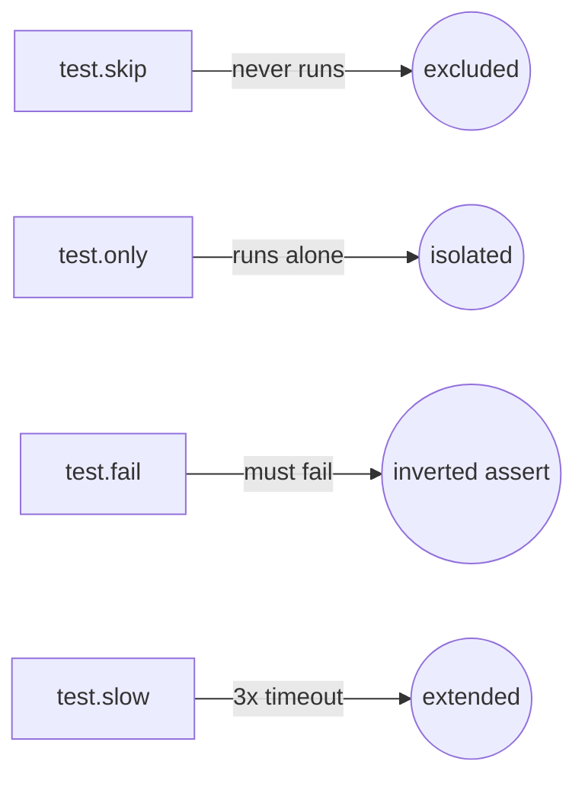
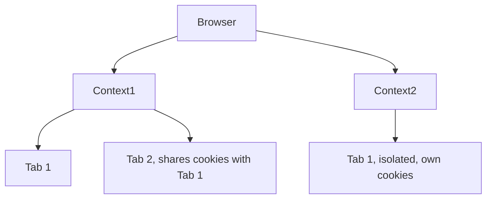

# Learning Playwright Fundamentals 2x

A hands-on starter project for learning [Playwright](https://playwright.dev/) end-to-end testing with TypeScript. Part of **The Testing Academy** Playwright Fundamentals course.

## Tech Stack

- [Playwright Test](https://playwright.dev/docs/intro) `^1.61.1`
- TypeScript / Node.js (`@types/node`)

## Prerequisites

- [Node.js](https://nodejs.org/) 18+ (LTS recommended)
- npm (ships with Node)

## Getting Started

```bash
# 1. Install dependencies
npm install

# 2. Install Playwright browsers
npx playwright install
```

## Running Tests

```bash
# Run all tests (headless)
npx playwright test

# Run in headed mode (watch the browser)
npx playwright test --headed

# Run a single spec
npx playwright test tests/01_Basics/229_Basic_Test.spec.ts

# Run in UI mode (interactive)
npx playwright test --ui

# Debug a test
npx playwright test --debug
```

## Recent Changes

- **Added custom HTML reporter** — `utils/CustomReporter.ts` generates detailed HTML reports with step-level breakdown, screenshots, videos, and traces. Open `Custom Report/index.html` to view the latest report.
- **Allure integration** — Added `allure-playwright` reporter alongside the custom reporter for Allure dashboard support.
- **Screenshots, video & trace** — Set to `'on'` for all tests (captured for every run, not just failures).
- **Custom Report folder** — All generated reports, screenshots, videos, and traces are stored in the `Custom Report/` directory.
- **New test modules**:
  - `tests/03_Locators_Commands/` — locator strategies (XPath, getByRole, getByTestId, press sequences, page objects)
  - `tests/04_Session_Storage/` — session storage and auth state reuse (247, 248)
  - `tests/06_Multiple_Element_/` — handling multiple elements with `allInnerTexts()`, `all()`, `getByTestId()`, and `.filter()` with `hasText`
  - `tests/07_WebTables/` — dynamic XPath web table traversal, pagination loops, `filter({ hasText })` row lookups, reusable pagination functions
- **`test.step()` integration** — Tests use `test.step()` blocks, which the custom reporter tracks individually with pass/fail status and timing.
- **`playwright.config.ts` updates**: `testDir` changed from `./e2e` to `./tests`, report output folder renamed, screenshot/video/trace enabled.
- **New test modules (Round 2)**:
  - `tests/06_Multiple_Element_/` — two specs demonstrating multiple element handling: `allInnerTexts()` + loop filtering, and the faster `getByTestId()`/`.filter({ hasText })` approach for element selection
  - `tests/07_WebTables/` — 7 specs covering web table traversal with dynamic XPath construction (`252`), structured table extraction (`253`), `.filter({ hasText })` locator matching (`254`), checkbox selection via preceding-sibling XPath (`255`), paginated row lookup with while-loop (`256`), paginated email scraping across pages (`257`), and reusable pagination functions (`258`)
- **New test modules (Round 3)**:
  - `tests/08_Web_Select_Frames_Iframe/` — custom dropdown interactions (`259`, `260`), advanced React-Select handling (`261`) covering single, multi, grouped, creatable, and async select boxes
  - `tests/Daily_Task/` — daily challenge scripts (SpiceJet ticket booking with autocomplete popup handling, MakeMyTrip automation attempts)
- **Custom Reporter improvements**:
  - Compact 11-column table (removed Author, Priority, End Time) for better fit
  - Icon-only action links (Screenshot/Video/Trace) with hover effects
  - Live **LIVE** badge with blinking dot during real-time report mode
  - File column shows only filename with full path on hover
  - Fixed terminal console table border alignment with visual-width-aware padding for emoji characters
  - `overflow-x: auto` on table container for responsive horizontal scroll

## Viewing the Report

### Custom HTML Report (detailed)

```bash
# Open the latest custom report
start Custom Report/index.html
```

### Playwright HTML Report (built-in)

```bash
npx playwright show-report
```

### Allure Report

```bash
npx allure generate allure-results --clean
npx allure open
```

## Project Structure

```
.
├── tests/
│   ├── 01_Basics/                    # Test anatomy, annotations (skip/only/fail/slow)
│   ├── 02_First_tests/               # Browser → Context → Page (BCP) hierarchy
│   ├── 03_Locators_Commands/         # Locator strategies (XPath, getByRole, etc.)
│   ├── 04_Session_Storage/           # Session / auth state reuse tests
│   ├── 06_Multiple_Element_/         # Handling multiple elements (allInnerTexts, filter, getByTestId)
│   ├── 07_WebTables/                 # Dynamic XPath, pagination, row filter functions
│   ├── 08_Web_Select_Frames_Iframe/  # Custom dropdown, React-Select, iframe interactions
│   ├── Daily_Task/                   # Daily challenge scripts
│   ├── Template.spec.ts              # Empty spec scaffold, copy for new tests
│   └── example.spec.ts               # Sample: title check + "Get started" navigation
├── utils/
│   └── CustomReporter.ts             # Custom HTML reporter with step tracking
├── Custom Report/                    # Generated reports (screenshots, videos, traces)
├── allure-results/                   # Allure report data
├── playwright.config.ts              # Playwright configuration
├── package.json
└── .gitignore
```

## What's Inside

`tests/example.spec.ts` demonstrates two core patterns:

1. **Assertions** — verify the page title matches `/Playwright/`.
2. **Navigation + role locators** — click the *Get started* link and assert the *Installation* heading is visible.

### 01 - Test Anatomy & Annotations

**Concept:** every Playwright spec is `test(name, async ({ page }) => {...})`: `page` is a fixture, injected fresh per test, not something you create. Annotations (`.skip`, `.only`, `.fail`, `.slow`) tag a test's execution mode without touching its body.

**Why:** during dev you constantly need to isolate one test (`.only`), silence a broken one (`.skip`), or flag a known-fail (`.fail`), without commenting code out.

**Q&A: why use this?**
- **Q: What breaks if `test.only` ships to CI?** A: Every other test in that run gets skipped, most CI configs (`forbidOnly: !!process.env.CI`) fail the build to catch this.
- **Q: `.skip` vs `.fail`?** A: `.skip` never runs the test. `.fail` runs it and expects a failure, flips to an error if it unexpectedly passes.
- **Q: Can I skip conditionally?** A: Yes, `test.skip(condition, reason)` inside the test body, e.g. skip only on `firefox`.



```ts
// Conditional skip, reads browserName from the fixture
test('conditional', async ({ page, browserName }) => {
    test.skip(browserName === 'firefox', 'Not supported in Firefox');
});
```

### 02 - Browser, Context, Page (BCP) Hierarchy

**Concept:** Playwright models automation in three nested layers: one **Browser** process, many **Contexts** (isolated sessions, like separate incognito windows), each with many **Pages** (tabs). Cookies/storage never leak across contexts; pages in the same context share them.

**Why:** testing multi-user flows (admin + guest, two logged-in accounts) needs real session isolation, launching a whole new browser per user is wasteful; a new context is cheap and isolated.

**Q&A: why use this?**
- **Q: When do I need a second context instead of a second page?** A: When the two sessions must NOT share cookies/auth, e.g. admin vs. viewer logged in simultaneously.
- **Q: Does the `test()` fixture give me a context for free?** A: Yes, `{ page }` already comes with its own context. Use `{ browser }` when a test needs to spin up *extra* contexts manually.
- **Q: What's the cleanup order?** A: Reverse of creation: close pages, then contexts, then the browser.



```ts
test("two users interact", async ({ browser }) => {
    const adminContext = await browser.newContext();
    const adminPage = await adminContext.newPage();

    const guestContext = await browser.newContext();
    const guestPage = await guestContext.newPage();

    await adminPage.goto("https://app.vwo.com/#login");
    await guestPage.goto("https://app.vwo.com/#dashboard/home");

    await adminContext.close();
    await guestContext.close();
});
```

Context options (`viewport`, `locale`, `timezoneId`, `geolocation`, or a full device profile like `userAgent` + `isMobile` for mobile emulation) are passed into `browser.newContext({...})`, see [`237_BCP_Test_Options.spec.ts`](tests/02_First_tests/237_BCP_Test_Options.spec.ts).

## Configuration Highlights

Defined in `playwright.config.ts`:

- `testDir: './tests'` — where specs live
- `testMatch: ['tests/**/*.spec.ts']` — recurses into every numbered module folder
- `fullyParallel: true` — run test files in parallel
- `reporter: [["line"], ["allure-playwright"], ["./utils/CustomReporter.ts"]]` — dual reporting (console + Allure + custom HTML)
- `trace: 'on'`, `screenshot: 'on'`, `video: 'on'` — full debug artifacts for every run
- Projects: Chromium active; Firefox and WebKit currently commented out
- CI-aware retries and workers (`process.env.CI`)
- Custom HTML report written to `Custom Report/` with per-step breakdown, screenshots, videos, and traces

## Learn More

- [Playwright Docs](https://playwright.dev/docs/intro)
- [The Testing Academy](https://thetestingacademy.com/)

## License

ISC
